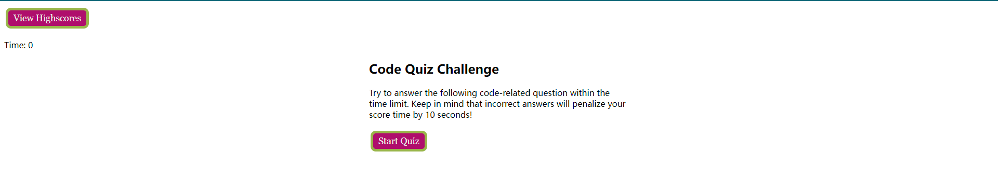
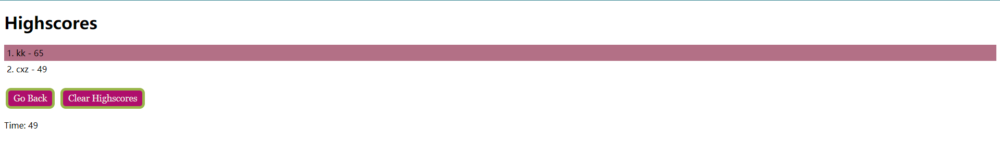

# Code-Quiz

## Description

The project creates a timed coding quiz with multiple-choice questions. This app will run in the browser and will feature dynamically updated HTML and CSS powered by JavaScript code. The quiz has 11 questions, once you finish them all, it will show the score(left time) you got and ask you to fill your initial. Then it will bring you to the score board, where list all the score store in local.

## Link

Click [here](https://jotaroc.github.io/Code-Quiz/) to the deployed website

## Screenshot

The following image is the sceenshot of web application's appearance and functionality:

---
Author:Xingzhi Chang
